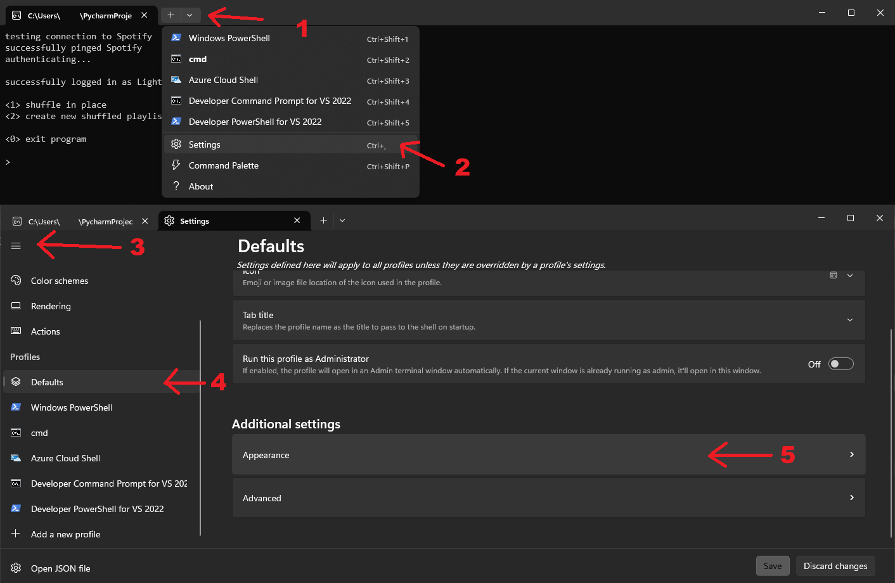

# Spotify Shuffler
When you listen to Spotify with shuffle play enabled, it's not actually random.  
Spotify plays you songs in an order it thinks you'd like to hear. Unfortunately, this algorithm is not very good,
and it ends up just playing you the same 20 songs over and over again.

The way around this is to shuffle the tracks themselves within the playlist, and then listen through the playlist with shuffle disabled.  
There are websites that do this for you, but not very well. 

Most of them get flagged by Norton as hostile phishing sites, and the rest are extremely slow, likely due to very inefficent API calls.
I wrote this program due to my dissatisfaction with current methods of shuffling playlists. 
It's open source, so feel free to poke around and play with the code.

## Setup:
1) First off, you'll need to register yourself as a Spotify developer and create an app. Don't worry, it sounds harder than it actually is. 
   1) To do this, see https://developer.spotify.com/documentation/web-api/concepts/apps
   2) Name your app whatever you want. For the redirect URI, I'd recommend using `http://localhost:8080`, although many URLs work.
2) Provide your client id, client secret, and redirect URI. You should only need to do this once.
3) Grant your new app permission to access your Spotify account.
4) Setup is done! It should automatically refresh your tokens as needed, with no further action required on your part.

Note: This app requires an internet connection to work.

## Running the app:

You can either shuffle the playlist in place, or create a new one.  

##### Shuffle in place:
The playlist's tracks will be shuffled, permanently. Songs, podcasts, and local files will be shuffled.
There's no way to get back the old order, so be certain you want to do this. 

##### Create new playlist:
Creates a playlist that's a duplicate of the old one, except shuffled. 
The description and cover art are carried over, and the title is the same but with `(shuffled)` appended.
All podcasts and Spotify-provided songs will be shuffled as normal. However, due to limitations with Spotify's API,
external applications (such as this one) cannot add local tracks to playlists.

## Explanation of required permissions:
##### View your Spotify account data
1) Your name and username, your profile picture, how many followers you have on Spotify and your public playlists  

This perm is required by default for the authentication type this program uses. 
Your user URI is used to hide playlists you can't edit, when editing in place.  
Your username is only used for the `successfully logged in as <username>` message.  
This never messes with your profile picture or followers in any way.

##### View your activity on Spotify
1) Playlists you’ve made and playlists you follow   
2) Your collaborative playlists

Used to provide the playlists for you to select and shuffle.

##### Take actions in Spotify on your behalf
1) Upload images to personalize your profile or playlist cover
2) Create, edit, and follow private playlists
3) Create, edit, and follow playlists  

`Upload images` is to upload the cover art when coping playlists with custom cover art.  
`Create, edit, and follow playlists` is used to, well, create and edit your playlists.

And don't just take my word for it! Go have a look at the code yourself, if you want.

##FAQ

##### Your program didn't shuffle my playlist in a way I like
Take it up with the people who wrote Python's `random.shuffle()` algorithm ¯\_(ツ)_/¯   

Keep in mind that due to the nature of randomness, 
it's very possible to get songs by the same artist right next to each other. In fact, this is why Spotify moved away
from their shuffle play algorithm being completely random. They got fed up with people complaining to Spotify support that
their tracks "weren't random enough" because they were getting several related songs in a row. 
Unfortunately, their algorithm doesn't work very well.

If you think you can do it better than me, go for it! Submit a pull request, open an issue, and I'll take a look. 
This is open source for a reason ^^

[//]: # (##### I'm stuck on `authenticating in browser...`)

[//]: # (That's because you have an invalid)

##### How can I change the font size/appearance?

[//]: # (![CMD -> settings. Under profiles -> defaults -> appearance info]&#40;images/cmd.png&#41;)
 settings. Under profiles -> defaults -> appearance info" width="700"/>
